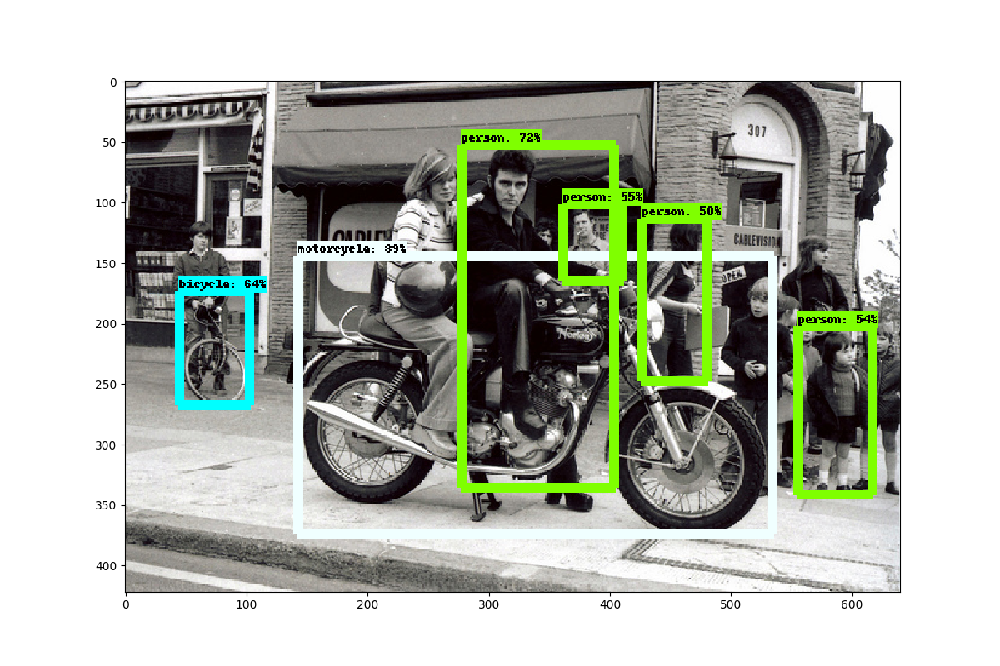

# Object Detection
A simple usage of [Tensorflow Object Detection API
](https://github.com/tensorflow/models/tree/master/research/object_detection) for identifying multiple objects in a single image.

## To Detect Objects
Execute ```detect_objects.py``` providing the appropriate image. <br>
Model Used : [ssd_resnet_50_fpn_coco](https://github.com/tensorflow/models/blob/master/research/object_detection/g3doc/detection_model_zoo.md)<br>
(Note: Max objects detected is set to 10 and the minimum score threshold is set to .5)

## Sample Output
 
Output:
```['motorcycle', 'person', 'bicycle']```